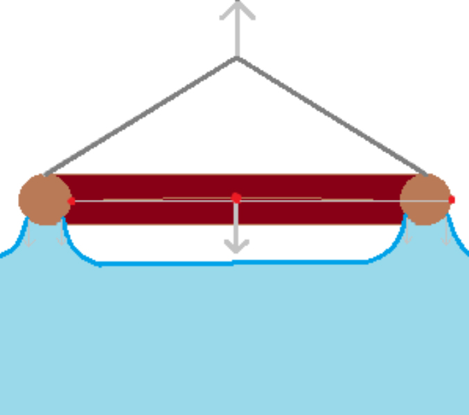

# Surface-tension-app

Qt-приложение для вычислений в области поверхностного натяжения жидкостей


***

## Чтобы запустить на Windows, введите в Terminal

```bash
python -m venv venv
```

```bash
call venv/Scripts/activate
```

```bash
pip install -r requirements.txt
```

```bash
python main.py
```

***

### Картинки используемых моделей

Пипетка с каплей


Тело в форме спички, плавающее на поверхности жидкости


Отрыв кольца



Вертикальный капилляр с полностью смачиваемой жидкостью


***

## Команды линтеров

```bash
black --exclude venv .
```

```bash
flake8 --exclude venv .
```
